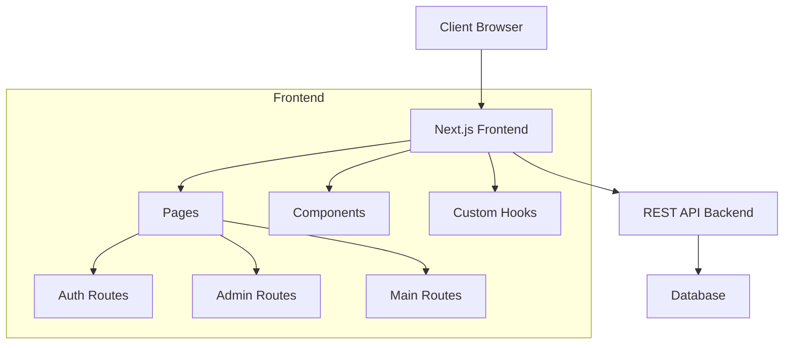
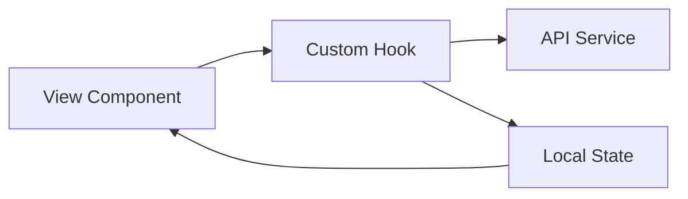

# Mẫu thiết kế hệ thống

## Kiến trúc tổng thể



## Cấu trúc ứng dụng

### 1. App Router (Next.js)
```
src/app/
├── (auth)/            # Route nhóm xác thực
│   ├── login/         # Đăng nhập
│   └── register/      # Đăng ký
├── (main)/            # Route nhóm người dùng
│   ├── my-account/    # Tài khoản
│   ├── services/      # Dịch vụ
│   └── schedule/      # Lịch hẹn
└── admin/             # Route nhóm quản trị
    ├── staff-manage/  # Quản lý nhân viên
    ├── cus-manage/    # Quản lý khách hàng
    └── schedule-manage/ # Quản lý lịch hẹn
```

### 2. Components
- Được tổ chức theo chức năng
- Tái sử dụng cao
- Tuân thủ nguyên tắc đơn trách nhiệm

### 3. Data Management
- Custom hooks cho API calls và quản lý state
- Context API cho state toàn cục
- Axios cho HTTP requests

## Mẫu thiết kế

### 1. State Management Pattern


### 2. Component Pattern
```typescript
// Mẫu cấu trúc component
interface Props {
  data: Type;
  onAction: (param: Type) => void;
}

const Component: React.FC<Props> = ({ data, onAction }) => {
  // Local state
  const [state, setState] = useState();

  // Side effects
  useEffect(() => {
    // Effect logic
  }, [dependencies]);

  // Event handlers
  const handleEvent = () => {
    // Handler logic
  };

  return (
    // JSX
  );
};
```

## Quy tắc thiết kế

### 1. API Integration
- Tập trung logic API trong các service modules
- Sử dụng custom hooks để tái sử dụng logic
- Xử lý lỗi nhất quán

```typescript
// Mẫu API Service
const apiService = {
  async getData(): Promise<Data> {
    try {
      const response = await axios.get(endpoint);
      return response.data;
    } catch (error) {
      handleError(error);
      throw error;
    }
  }
};
```

### 2. Authentication
- JWT-based authentication
- Token được lưu trong cookies
- Refresh token flow
- Route protection

### 3. Error Handling
- Xử lý lỗi tập trung
- Toast notifications cho user feedback
- Error boundaries cho React components

## Quy ước kỹ thuật

### 1. TypeScript
- Strict mode enabled
- Interface cho Props và State
- Type guards khi cần thiết

### 2. Styling
- Tailwind CSS cho styling
- Responsive design
- Mobile-first approach

### 3. Performance
- Code splitting
- Lazy loading
- Image optimization
- Caching strategies

## Monitoring và Logging

### 1. Error Tracking
- Console logging trong development
- Error reporting trong production

### 2. Performance Monitoring
- Core Web Vitals
- Loading performance
- Runtime performance
